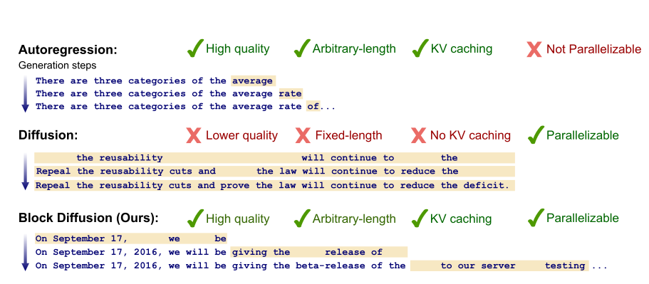

# AR, MDLM & BD3LM Language Models

What are AR, MDLM, and BD3LM language models?

AR - autoregressive language model  
MDLM - Masked diffusion language model  
BD3LM - Block Discrete Denoising Diffusion Language model  

assume the input sentence:

```
the cat sat on the table
```

tokens:

```
x = [the, cat, sat, on, the, table]
```

---

# AR - Autoregressive Language Model

The AR model uses **transformer causal attention**  
which predicts the **next token based on previous tokens**.

attention mask looks like

```
1 0 0 0 0 0
1 1 0 0 0 0
1 1 1 0 0 0
1 1 1 1 0 0
1 1 1 1 1 0
1 1 1 1 1 1
```

Token visibility:

```
Token 1 (the) → sees the
Token 2 (cat) → sees the cat
Token 3 (sat) → sees the cat sat
Token 4 (on)  → sees the cat sat on
Token 5 (the) → sees the cat sat on the
Token 6 (table) → sees the cat sat on the table
```

so the tokens only have access to the **current and previous tokens**.

generation happens **sequentially**

```
token1 → token2 → token3 → ... → tokenL
```

---

### Probability Factorization

Autoregressive models follow the chain rule

$$
p(x) = \prod_{i=1}^{L} p(x_i \mid x_{<i})
$$

where

$$
x_{<i} = (x_1, x_2, ..., x_{i-1})
$$

---

### Example

assume we're predicting x3 = sat, the model computes

$$
p(sat \mid the, cat)
$$

so it only sees the **previous tokens**.

---

# MDLM - Masked Diffusion Language Model

The MDLM uses **bidirectional attention (BERT style)**.

This means **each token can see all tokens in the input**.

attention mask becomes

```
1 1 1 1 1 1
1 1 1 1 1 1
1 1 1 1 1 1
1 1 1 1 1 1
1 1 1 1 1 1
1 1 1 1 1 1
```

so every token can attend to **all other tokens**.

---

## Noise Process

Diffusion models introduce **noise during training**.

define noise level

```
t ∈ [0,1]
```

```
t = 0   → no noise
t = 0.5 → 50% noise
t = 1   → fully masked
```

forward corruption process

$$
q(x_t^i \mid x_0^i)
=
(1-t)\mathbf{1}(x_t^i = x_0^i)
+
t\mathbf{1}(x_t^i = m)
$$

where

```
m = MASK token
```

---

### Example

input sentence

```
the cat sat on the table
```

masked sample

```
the [MASK] sat [MASK] the [MASK]
```

model must predict masked tokens.

---

### Training Objective

Diffusion training objective

$$
L =
\mathbb{E}_{t,x}
\left[
\sum_{i \in M_t}
-\log p_\theta(x_i \mid x_t)
\right]
$$

where

```
Mt = masked token positions
```

---

### Token Prediction Example

input

```
x = [the, [MASK], sat, [MASK], the, [MASK]]
```

assume predicting token 2

```
x2 = cat
```

model computes

$$
p(cat \mid the, sat, the)
$$

but in practice the model input still contains masks

```
the [MASK] sat [MASK] the [MASK]
```

so mathematically the model learns

$$
p(x_i \mid x_{-i})
$$

where

```
x_{-i} = all tokens except x_i
```

so the model can see **both past and future tokens**.

---

# Block Discrete Denoising Diffusion Language Model (BD3LM)

BD3LM combines **autoregressive ordering + diffusion inside blocks**.

Instead of generating the whole sequence at once  
we divide the tokens into **blocks**.

---

### Example

split sequence

```
assume B = 2

block1 → the cat sat
block2 → on the table

so it becomes x = [x¹, x²]
```

---

### Probability Factorization

BD3 factorization

$$
p(x) = \prod_{b=1}^{B} p(x^{b} \mid x_{<b})
$$

where

```
x<b = previous blocks
```

---

### Diffusion Inside Block

inside a block tokens are predicted with diffusion.

example masking

```
b1 = [the, [MASK], sat]
b2 = [on, the, [MASK]]
```

---

### Step 1 (Block 1)

model predicts masked tokens inside block1

```
p(cat \mid the, sat)
```

block1 only sees **block tokens**.

### Step 2 (Block 2)

block2 now sees **block1 tokens as context**

```
p(table \mid the, cat, sat, on, the)
```

so previous blocks become clean fixed context.

---

# Why KV cache works for BD3LM but not MDLM

### MDLM generation

Diffusion repeatedly updates tokens

```text
step1 → the [MASK] sat [MASK] table
step2 → the cat sat on table
step3 → the cat sat on the table
```

tokens change every step. so transformer states **cannot be reused**. KV cache invalid because

```
keys/values depend on tokens
tokens change every step
```

so cache must be recomputed.

---

### BD3LM generation

BD3 generates **block by block**

```
block1 → finalized
block2 → generated next
```

once block1 is finished it **never changes**. so

```
KV(block1) can be cached
```

block2 attends to cached states from block1.

# Key Difference



AR model learns

$$
p(x_i \mid x_{<i})
$$

MDLM learns

$$
p(x_i \mid x_{-i})
$$

BD3LM learns

$$
p(x^b \mid x_{<b})
$$

where each block internally uses diffusion.

Masking is the only modification introduced here, all other components, including the Transformer layers, FeedForward blocks, and normalization layers, remain unchanged.
