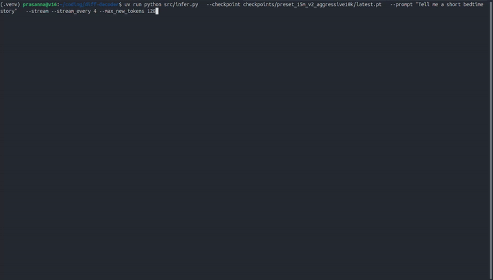

# AR, MDLM & BD3LM Language Models

This is an experiment around MDL3M and block diffusion, inspired by Mercury, main focus was analyzing the attention layer differences across AR, MDLM, and BD3LM architectures.

I wrote clean blog here checkout [!here](https://x.com/jaga_prasanna/status/2052273927490281691) 


## Demo




## Train (custom diffusion model on TinyStories)

```bash
uv run python src/train.py \
  --output_dir checkpoints/tinystories_diffusion_v1 \
  --max_steps 10000 \
  --batch_size 32 \
  --max_seq_len 256 \
  --num_diffusion_steps 64
```

## Inference from a saved checkpoint (`.pt`)

```bash
uv run python src/infer.py \
  --checkpoint checkpoints/tinystories_diffusion_v1/latest.pt \
  --prompt "Once upon a time" \
  --max_new_tokens 128 \
  --temperature 0.8
```

Live diffusion streaming:

```bash
uv run python src/infer.py \
  --checkpoint checkpoints/tinystories_diffusion_v1/latest.pt \
  --prompt "Tell me a short bedtime story" \
  --stream \
  --stream_every 4
```
 

## Quick model test / throughput (`src/test.py`)

Causal mode:

```bash
uv run python src/test.py \
  --model /path/to/model \
  --prompt "Write a Python palindrome checker." \
  --max-new-tokens 128
```

Diffusion (BD3LM) mode:

```bash
uv run python src/test.py \
  --model /path/to/model \
  --enable-diffusion \
  --prompt "Write a Python palindrome checker." \
  --max-new-tokens 128 \
  --steps 128 \
  --block-size 32
```

Diffusion with live stream:

```bash
uv run python src/test.py \
  --model /path/to/model \
  --enable-diffusion \
  --stream \
  --stream-every 4
``` 