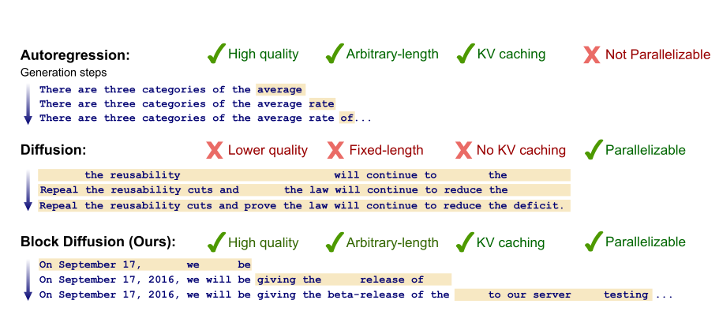

# AR, MDLM & BD3LM Language Models

What are AR, MDLM, and BD3LM language models?

AR - autoregressive language model
MDLM - Masked diffusion language model
BD3LM - Block Discrete Denoising Diffusion Language model

assume the input sentence:

```
the cat sat on the table
```

tokens:

```
x = [the, cat, sat, on, the, table]
```

---

# AR - Autoregressive Language Model

The AR model uses **transformer causal attention**
which predicts the **next token based on previous tokens**.

attention mask looks like

```
1 0 0 0 0 0
1 1 0 0 0 0
1 1 1 0 0 0
1 1 1 1 0 0
1 1 1 1 1 0
1 1 1 1 1 1
```

Token visibility:

```
Token 1 (the) → sees the
Token 2 (cat) → sees the cat
Token 3 (sat) → sees the cat sat
Token 4 (on)  → sees the cat sat on
Token 5 (the) → sees the cat sat on the
Token 6 (table) → sees the cat sat on the table
```

so the tokens only have access to the **current and previous tokens**.

generation happens **sequentially**

```
token1 → token2 → token3 → ... → tokenL
```

---

### Probability Factorization

Autoregressive models follow the chain rule

```math
p(x) = \prod_{i=1}^{L} p(x_i \mid x_{1:i-1})
```

where

```math
x_{1:i-1} = (x_1, x_2, ..., x_{i-1})
```

---

### Example

assume we're predicting x3 = sat, the model computes

```math
p(sat \mid the, cat)
```

so it only sees the **previous tokens**.

---

# MDLM - Masked Diffusion Language Model

The MDLM uses **bidirectional attention (BERT style)**.

This means **each token can see all tokens in the input**.

attention mask becomes

```
1 1 1 1 1 1
1 1 1 1 1 1
1 1 1 1 1 1
1 1 1 1 1 1
1 1 1 1 1 1
1 1 1 1 1 1
```

so every token can attend to **all other tokens**.

---

## Noise Process

Diffusion models introduce **noise during training**.

define noise level

```
t ∈ [0,1]
```

```
t = 0   → no noise
t = 0.5 → 50% noise
t = 1   → fully masked
```

forward corruption process

```math
q(x_t^i \mid x_0^i) = (1-t)\,I[x_t^i = x_0^i] + t\,I[x_t^i = m]
```

where

```
m = MASK token
```

---

### Example

input sentence

```
the cat sat on the table
```

masked sample

```
the [MASK] sat [MASK] the [MASK]
```

model must predict masked tokens.

---

### Training Objective

Diffusion training objective

```math
L = E_{t,x}\Big[\sum_{i \in M_t} -\log p_{\theta}(x_i \mid x_t)\Big]
```

where

```
Mt = masked token positions
```

---

### Token Prediction Example

input

```
x = [the, [MASK], sat, [MASK], the, [MASK]]
```

assume predicting token 2

```
x2 = cat
```

model computes

```math
p(cat \mid the, sat, the)
```

but in practice the model input still contains masks

```
the [MASK] sat [MASK] the [MASK]
```

so mathematically the model learns

```math
p(x_i \mid x_{-i})
```

where

```
x_{-i} = all tokens except x_i
```

so the model can see **both past and future tokens**.

---

# Block Discrete Denoising Diffusion Language Model (BD3LM)

BD3LM combines **autoregressive ordering + diffusion inside blocks**.

Instead of generating the whole sequence at once
we divide the tokens into **blocks**.

---

### Example

split sequence

```
assume B = 2

block1 → the cat sat
block2 → on the table

so it becomes x = [x¹, x²]
```

---

### Probability Factorization

BD3 factorization

```math
p(x) = \prod_{b=1}^{B} p(x^{b} \mid x_{1:b-1})
```

where

```
x_{1:b-1} = previous blocks
```

---

### Diffusion Inside Block

inside a block tokens are predicted with diffusion.

example masking

```
b1 = [the, [MASK], sat]
b2 = [on, the, [MASK]]
```

---

### Step 1 (Block 1)

model predicts masked tokens inside block1

```
p(cat \mid the, sat)
```

block1 only sees **block tokens**.

### Step 2 (Block 2)

block2 now sees **block1 tokens as context**

```
p(table \mid the, cat, sat, on, the)
```

so previous blocks become clean fixed context.

---

# Why KV cache works for BD3LM but not MDLM

### MDLM generation

Diffusion repeatedly updates tokens

```text
step1 → the [MASK] sat [MASK] table
step2 → the cat sat on table
step3 → the cat sat on the table
```

tokens change every step. so transformer states **cannot be reused**. KV cache invalid because

```
keys/values depend on tokens
tokens change every step
```

so cache must be recomputed.

---

### BD3LM generation

BD3 generates **block by block**

```
block1 → finalized
block2 → generated next
```

once block1 is finished it **never changes**. so

```
KV(block1) can be cached
```

block2 attends to cached states from block1.

# Key Difference



AR model learns

```math
p(x_i \mid x_{1:i-1})
```

MDLM learns

```math
p(x_i \mid x_{-i})
```

BD3LM learns

```math
p(x^b \mid x_{1:b-1})
```

where each block internally uses diffusion.

Masking is the only modification introduced here, all other components, including the Transformer layers, FeedForward blocks, and normalization layers, remain unchanged.

---

# Training Presets (Best-Known Config, 6GB VRAM Tuned)

Based on local sweep + confirm runs (`tmp_hparam_sweep`, `tmp_hparam_confirm`), the best stable recipe is:

- `lr=6e-4`
- `min_lr=3e-5`
- `num_diffusion_steps=64`
- `dropout=0.1`
- `ffn_mult=4.0`
- `n_heads=8`
- `n_kv_heads=2`
- `max_seq_len=256`
- `weight_decay=0.1`
- `grad_clip=1.0`

For 6GB VRAM, these presets are tuned to push GPU usage while keeping a safe OOM margin.
All commands below include the full important args.

### More Aggressive Learning-Rate Options

If you want faster early learning, try these drop-in LR variants (from mildly to very aggressive):

- Aggressive A: `lr=8e-4`, `min_lr=4e-5`, `warmup_steps=40`
- Aggressive B: `lr=1.0e-3`, `min_lr=5e-5`, `warmup_steps=60`
- Aggressive C: `lr=1.2e-3`, `min_lr=6e-5`, `warmup_steps=80`

Quick override examples:

```bash
# Aggressive A
--lr 8e-4 --min_lr 4e-5 --warmup_steps 40

# Aggressive B
--lr 1.0e-3 --min_lr 5e-5 --warmup_steps 60

# Aggressive C
--lr 1.2e-3 --min_lr 6e-5 --warmup_steps 80
```

Recommended usage:

- start with Aggressive A for 5M/10M presets
- use Aggressive B only if loss is still smooth after ~500-1000 steps
- use Aggressive C only for short experiments; if training becomes unstable, fall back to A or increase warmup

Preset variants by model size:

## 5M preset (~4.94M params)

- `dim=208`
- `n_layers=4`
- tuned for 6GB: very fast iteration baseline
- train command:

```bash
./.venv/bin/python src/train.py \
  --dataset_name roneneldan/TinyStories --train_split train --eval_split validation \
  --tokenizer_name_or_path vuiseng9/bpe-10.0k-tinystories \
  --dim 208 --n_layers 4 --n_heads 8 --n_kv_heads 2 \
  --max_seq_len 256 --num_diffusion_steps 64 \
  --batch_size 32 --eval_batch_size 32 --grad_accum_steps 1 \
  --num_workers 2 \
  --lr 6e-4 --min_lr 3e-5 --warmup_steps 30 \
  --weight_decay 0.1 --grad_clip 1.0 \
  --dropout 0.1 --ffn_mult 4.0 \
  --max_steps 20000 \
  --log_every 20 --eval_every 500 --save_every 1000 \
  --seed 42 \
  --output_dir checkpoints/preset_5m \
  --max_train_examples 0 --max_eval_examples 0
```

## 10M preset (~10.07M params)

- `dim=352`
- `n_layers=5`
- tuned for 6GB: high throughput target
- train command:

```bash
./.venv/bin/python src/train.py \
  --dataset_name roneneldan/TinyStories --train_split train --eval_split validation \
  --tokenizer_name_or_path vuiseng9/bpe-10.0k-tinystories \
  --dim 352 --n_layers 5 --n_heads 8 --n_kv_heads 2 \
  --max_seq_len 256 --num_diffusion_steps 64 \
  --batch_size 24 --eval_batch_size 24 --grad_accum_steps 1 \
  --num_workers 2 \
  --lr 6e-4 --min_lr 3e-5 --warmup_steps 30 \
  --weight_decay 0.1 --grad_clip 1.0 \
  --dropout 0.1 --ffn_mult 4.0 \
  --max_steps 20000 \
  --log_every 20 --eval_every 500 --save_every 1000 \
  --seed 42 \
  --output_dir checkpoints/preset_10m \
  --max_train_examples 0 --max_eval_examples 0
```

## 20M preset (~19.95M params)

- `dim=400`
- `n_layers=8`
- tuned for 6GB: balanced memory/throughput
- train command:

```bash
./.venv/bin/python src/train.py \
  --dataset_name roneneldan/TinyStories --train_split train --eval_split validation \
  --tokenizer_name_or_path vuiseng9/bpe-10.0k-tinystories \
  --dim 400 --n_layers 8 --n_heads 8 --n_kv_heads 2 \
  --max_seq_len 256 --num_diffusion_steps 64 \
  --batch_size 16 --eval_batch_size 16 --grad_accum_steps 2 \
  --num_workers 2 \
  --lr 6e-4 --min_lr 3e-5 --warmup_steps 30 \
  --weight_decay 0.1 --grad_clip 1.0 \
  --dropout 0.1 --ffn_mult 4.0 \
  --max_steps 20000 \
  --log_every 20 --eval_every 500 --save_every 1000 \
  --seed 42 \
  --output_dir checkpoints/preset_20m \
  --max_train_examples 0 --max_eval_examples 0
```

## 30M preset (~29.95M params)

- `dim=464`
- `n_layers=9`
- tuned for 6GB: memory-tight setting
- train command:

```bash
./.venv/bin/python src/train.py \
  --dataset_name roneneldan/TinyStories --train_split train --eval_split validation \
  --tokenizer_name_or_path vuiseng9/bpe-10.0k-tinystories \
  --dim 464 --n_layers 9 --n_heads 8 --n_kv_heads 2 \
  --max_seq_len 256 --num_diffusion_steps 64 \
  --batch_size 8 --eval_batch_size 8 --grad_accum_steps 4 \
  --num_workers 2 \
  --lr 6e-4 --min_lr 3e-5 --warmup_steps 30 \
  --weight_decay 0.1 --grad_clip 1.0 \
  --dropout 0.1 --ffn_mult 4.0 \
  --max_steps 20000 \
  --log_every 20 --eval_every 500 --save_every 1000 \
  --seed 42 \
  --output_dir checkpoints/preset_30m \
  --max_train_examples 0 --max_eval_examples 0
```

If you still see OOM on 6GB:

- first lower `--batch_size` by 2x
- then increase `--grad_accum_steps` by 2x to keep effective batch similar
